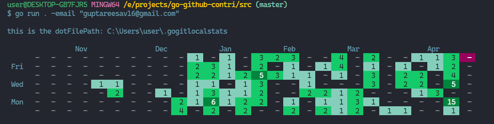

# Git Contribution Visualizer

A terminal-based GitHub-style contribution graph visualizer written in Go.

## Features

- GitHub-style contribution graph in the terminal
- Track any local Git repository using the `-add` flag
- Displays contribution activity for the past 6 months
- Stores added repositories locally
- Built with idiomatic Go

## Screenshot

